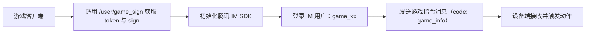

# 🎮 IM 接入前置说明文档

------

## 概述

本文档说明如何在自定义游戏中接入腾讯云即时通讯（IM），以实现与设备的实时通信控制。

完成本文步骤后，开发者可获取以下关键字段：

| 字段    | 含义                              |
| ------- | --------------------------------- |
| `uid`   | 用户唯一标识，如 `game_5`         |
| `token` | 游戏鉴权令牌                      |
| `appid` | 腾讯 IM SDKAppID                  |
| `sign`  | 用户签名（userSig，用于 IM 登录） |

------

## 接入流程总览




------

## 获取鉴权信息

### 接口说明

**接口名称：** 用户登录 IM 获取签名
 **请求方式：** `POST`
 **请求地址：**

```
https://suo.jiushu1234.com/api.php/user/game_sign
```

### 请求参数

请求参数包含的字段有以下两种情况：

- connect_string（优选使用）
- uid 和 token（已废弃，不建议使用，后续会删除此获取 IM 签名方式）

| 参数名         | 类型   | 必填 | 说明                                               |
| -------------- | ------ | ---- | -------------------------------------------------- |
| `uid`          | String | ❌    | 游戏内用户ID，格式固定为 `game_` 前缀，如 `game_5` |
| `token`        | String | ❌    | 游戏鉴权令牌，从游戏链接中获取                     |
| `connect_code` | String | ❌    | app内复制的连接码（“`UID`空格`Token`”）            |

### 响应示例

```json
{
  "code": 1,
  "msg": "ok",
  "data": {
    "appid": "1400853470",
    "sign": "eJwtzEELgjAYxvHvsnPoXm0LhS4iIlGHSj0JMdqUl1pNXRJE372lHp-fH54PKfZnb1Q9iUngUbKaNkr1sNjgxK3Q6sIorGGpg7wJY1CSGDilFHjE2FzU22CvnDPGApdmtaj-tuHAwxCiaHnB1p3ncAJe5e296XRqB9wVqUy6Z1LJ2h*Frv2ueR2zPivL4nDdku8PSzkzfg__"
  }
}
```

### 返回字段说明

| 参数名  | 类型   | 说明                 |
| ------- | ------ | -------------------- |
| `appid` | String | 腾讯 IM SDKAppID     |
| `sign`  | String | 用户签名（userSig）  |
| `code`  | Number | 状态码：`1` 表示成功 |
| `msg`   | String | 状态信息             |

------

## IM 初始化与登录

### 示例代码

```javascript
// 初始化 IM SDK
let chat = $TC.create({
  SDKAppID: appid // 上一步接口返回
});

// 登录 IM 用户
chat.login({
  userID: 'game_5', // 必须与 uid 一致
  userSig: sign     // 接口返回的签名
});
```

> ⚠️ 注意：`userID` 必须以 `game_` 前缀命名，否则会导致消息接收异常。

------

## 发送指令消息

### 消息格式规范

所有自定义游戏消息统一封装为 JSON，放置在 `payload.text` 字段中。

**格式示例：**

**⚠️此格式为「自定义游戏（⚠️即将废弃）」发送格式，推荐使用「开发游戏」实现玩法，「开发游戏」中的指令格式与本文档格式不同，见 [发送执行指令](README.md#发送执行指令) 中的格式（下方data: Number改为id:String）**

```json
{
  "code": "game_info",
  "data": 1,
  "token": "OWs4sZtTP056b9b7fa21752b173e8c1139c1baac5d4"
}
```

| 字段名  | 类型   | 说明                                                     |
| ------- | ------ | -------------------------------------------------------- |
| `code`  | String | 固定为 `"game_info"`                                     |
| `data`  | Number | 指令编号（`0`: miss, `1`: hit, `2`: bomb，自定义可扩展） |
| `token` | String | 登录时使用的 token，用于消息验证                         |

------

### 发送示例

⚠️此处是「联动游戏-新建游戏-自定义游戏」中的接口规范，「联动游戏-新建游戏-开发游戏」请见 [发送执行指令](README.md#发送执行指令)

```javascript
// 创建并发送文本消息
let message = chat.createTextMessage({
  to: String(5), // 目标用户ID（不带 game_ 前缀）
  conversationType: $TC.TYPES.CONV_C2C,
  payload: {
    text: JSON.stringify({
      code: 'game_info',
      data: 2, // 指令编号（如 2 表示“强刺激”）
      token: 'OWs4sZtTP056b9b7fa21752b173e8c1139c1baac5d4'
    })
  }
});

// 发送消息
chat.sendMessage(message);
```

------

## 通信原理说明

IM 充当游戏与设备的消息中转通道：

```
[游戏客户端] → [腾讯IM] → [设备控制端]
```

1. 游戏客户端发送带有 `code: game_info` 的 JSON 消息；
2. IM 将消息转发至目标用户（设备端）；
3. 设备端解析 `data` 字段，并触发相应的电刺激模式。

------

## 注意事项

1. **uid 与 to 的区别：**
   - 登录使用：`userID = game_5`
   - 消息发送：`to = "5"`
2. **token 必须有效：**
    从游戏连接码中获取，去除首尾空格换行等后以空格分割取第二段。过期或伪造将导致消息被拒绝。
3. **code 固定值：**
    所有控制消息使用 `code: "game_info"`（旧接口），否则设备不响应。
4. **data 可扩展：**
    支持开发者自定义动作序号（旧接口） 3、4、5... 对应不同波形、强度等。

------

## 附录：字段与动作对照表

| data 数值 | 含义       | 默认行为                             |
| --------- | ---------- | ------------------------------------ |
| 0         | miss       | 无效触发 / 停止输出                  |
| 1         | hit        | 轻度刺激                             |
| 2         | bomb       | 强刺激                               |
| 3+        | 自定义动作 | 需由游戏端定义并在设备端注册对应行为 |

